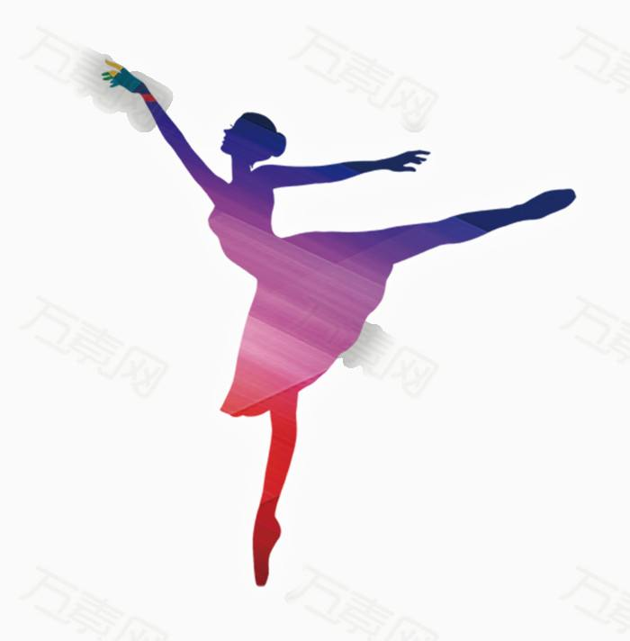
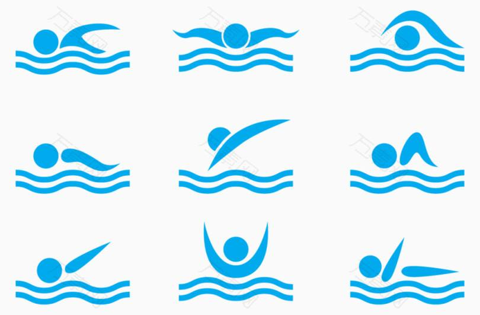
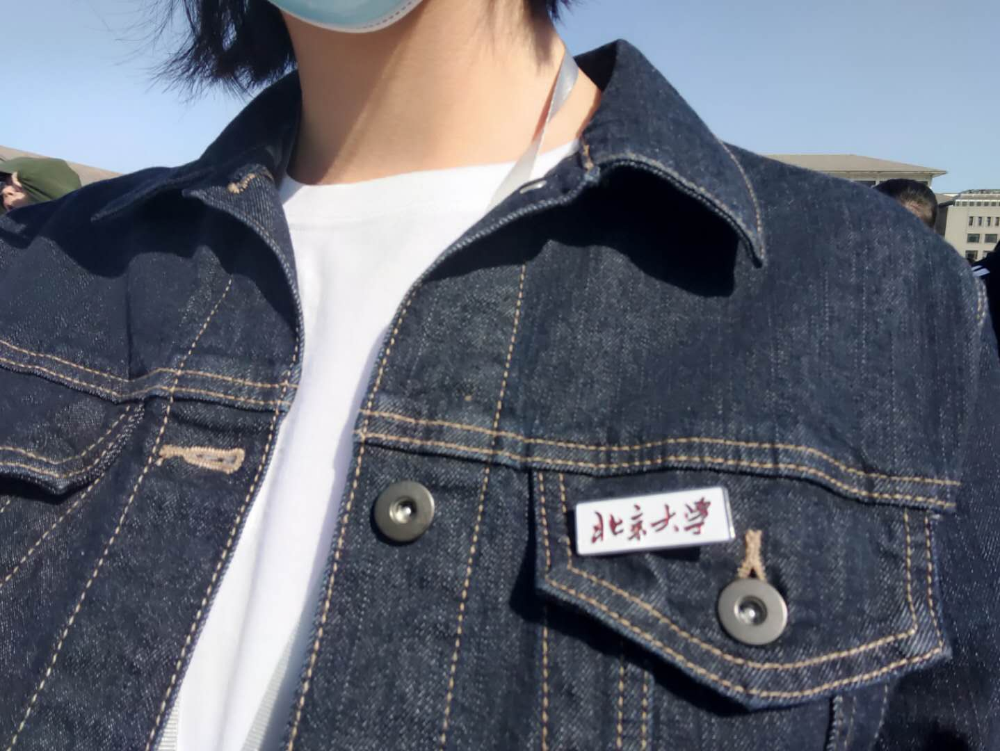
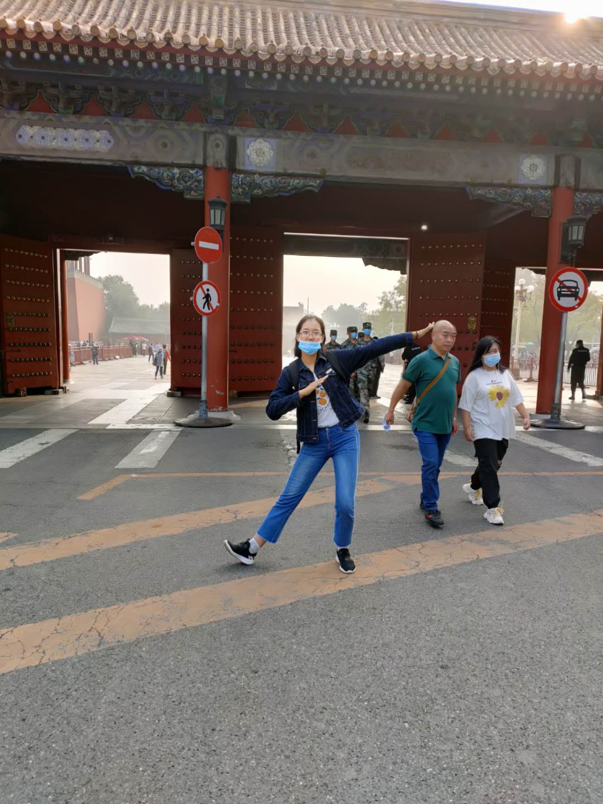
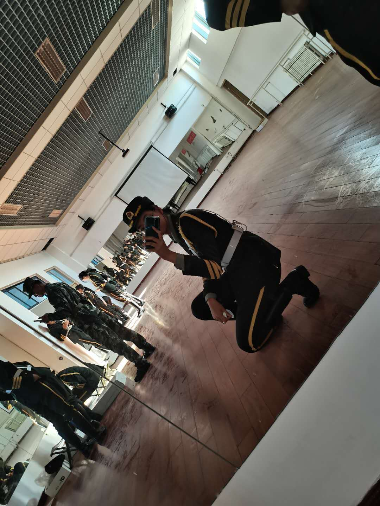

<head>
<meta charset="utf-8"/>

<body>
  <h1>成长经历</h1>
  
在2003年一个平凡的中午，吉林省的一个小山城里，降生了两个普普通通的婴儿。她们分别是大田和小田。（嘻嘻，小田就是我啦！）在一家人的悉心照料下，小田快乐的茁壮成长。妈妈每天打理家务，爸爸勤奋工作，奶奶给家中掌勺，姐姐陪我一起成长。历经了17年中规中矩的成长历程，小田第一次张开了翅膀，成为了一名PKUer，在燕园开启了一段新的人生旅程！

  <h2>个人档案</h2>
  
姓名：田镓境

  
 出生地：吉林省白山市

  
  身高：178cm

  
  体重：轻飘飘

  
  外貌特点：不喜打扮，高度近视（看电视剧看的）

   
性格自评：热情率真爱热闹，不拘小节常欢笑（其实有点天然呆）

   <h3>兴趣爱好简介</h3>
   <ul>
 <li>跳舞（跳的不是很好，主要是图个happy）</li>
 <li>游泳（超级喜欢float的感觉）</li>
 <li>乒乓球（当然不是大佬啦）</li>
 <li>篮球（迫于高度近视而终止了这个爱好）</li>
 </ul>
 
 
 
 
 <h4>生活片段节选</h4>
 
来到PKU的日子总是欢乐多多。从第一次带上北京大学的校徽，我就融入了这个大家庭之中。军训期间，国旗班的训练让我收获了意志和满满的光荣感；上课期间，知识与新技能的学习让我倍感新奇；班级团建时，故宫的古典韵味让我叹为观止。

 
 
 
 

